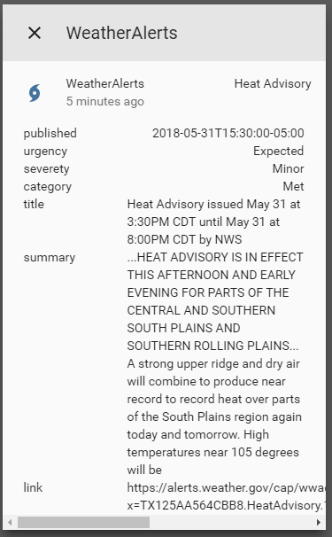

# custom_component to get info from alerts.weather.gov

  
A platform which allows you to get information from alerts.weather.gov. 
  
To get started put `/custom_components/sensor/weatheralerts.py` here:
`<config directory>/custom_components/sensor/weatheralerts.py`  
  
**Example configuration.yaml:**
```yaml
sensor:
  platform: weatheralerts
  sameid: 2190400
```
**Configuration variables::**  
key | description
:---|:---
**platform (Required)** | The platform name.  
**sameid (Required)** | The SAME ID for your county.  
#### Sample overview

  
[Home-Assistant demo site.](https://ha-test-weatheralerts.halfdecent.io)
  
To find the sameid go to [http://www.nws.noaa.gov/nwr/coverage/county_coverage.html](http://www.nws.noaa.gov/nwr/coverage/county_coverage.html).  
